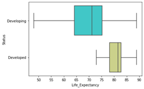
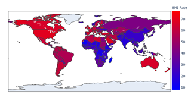
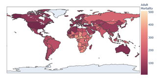
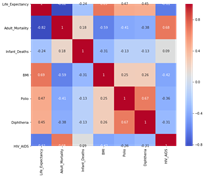
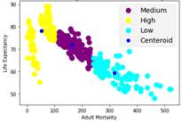
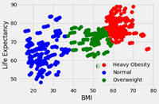
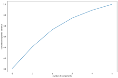
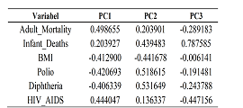

# Project Overview 
* Making Exploratory Data Analysis For Life Expectation Dataset
* Clustering Two Variables (Adult Mortality and BMI)
* PCA Analysis For Life Expectation Dataset

## EDA

## Clustering

## PCA
Principal component analysis is an analysis that aims to reduce dimensional data by generating new variables or main components which are linear combinations of the original variables so that the variance of the principal components is maximum and the principal components are mutually independent.

