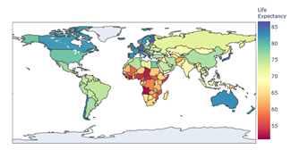

# Life_Expectancy

Skin cancer is a type of cancer that is characterized by abnormal cell growth in the epidermis, such as the appearance of bumps, spots, or moles with abnormal shape and size. Skin cancers develop due to exposure to Ultra-Violet (UV) radiation which causes changes in the genetic material namely the DNA composition. In this project I use convolutional neural network (CNN) using tensorflow for processing the images of skin cancer. For the website i use streamlit and deployed the model on Heroku. I build two models, basic model and improved model. I don't upload the model because the size of model is big, but you can see the architecture of my models from the notebooks.

## EDA
I looked at the distributions of the data and the value counts for the various categorical variables. Below are a few highlights from the pivot tables. 

### Demo Website 

